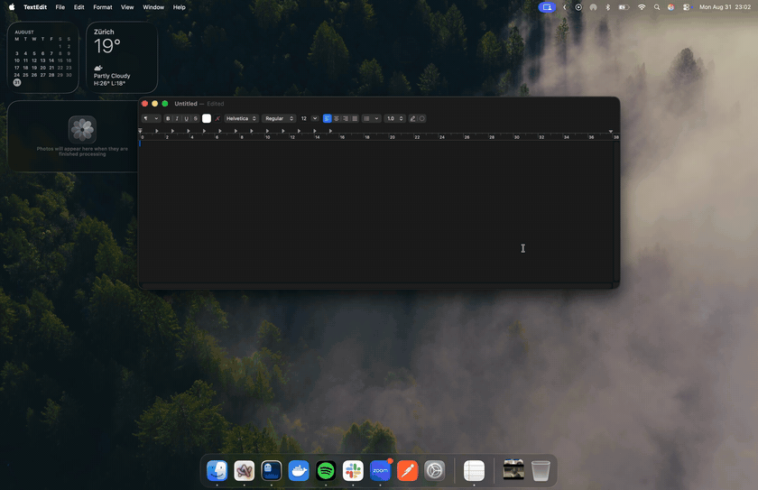

# Whisk

An open-source clipboard manager for macOS, inspired by
[Paste](https://pasteapp.io/). A menu bar app that remembers everything you
copy — text, links, images, files, colors — and brings it back through a
Paste-style panel at the bottom of your screen.



*(Crisp MP4: [docs/media/demo.mp4](docs/media/demo.mp4), also attached to the [releases](https://github.com/nathan-poncet/whisk/releases).)*


Built in Swift/SwiftUI following Clean Architecture: a pure, synchronous
kernel behind ports, adapters at the edges, and a composition root that wires
them together. See [docs/ARCHITECTURE.md](docs/ARCHITECTURE.md)
([français](docs/fr/ARCHITECTURE.md)).

## Features

- **Clipboard history** — every copy is captured and persisted locally,
  newest first, deduplicated.
- **Liquid Glass panel** — `⇧⌘V` opens a floating glass panel (the macOS 26
  look, translucent materials on earlier systems); click a card to copy it
  back (and paste it directly when Accessibility access is granted). The
  shortcut follows your keyboard layout — `V` is wherever your layout
  prints it (Dvorak, AZERTY, Colemak, …), re-resolved live when you switch
  layouts.
- **Per-app styling** — each card carries the icon of the application it
  was copied from and takes its tint from that app's icon.
- **Search** — type to filter text, links and file names instantly; `Return`
  selects the first match.
- **Filters** — a chip bar narrows the rail by source application (one chip
  per app, with its icon) and by content category (text, code, color, link,
  image, files); chips combine with each other and with the search query.
- **Pins** — pin a card (`⌘P` or right-click) and filter to pinned items
  with one chip; pinned items survive *Clear*, eviction and retention.
- **Retention** — keep history forever, or auto-expire after 24 hours,
  7 days or 30 days; capacity is configurable too (Settings).
- **Launch at login** — one toggle in Settings.
- **Rich previews** — copied links show the page's title, favicon and lead
  image; files show a QuickLook thumbnail; images render inline; hex codes
  become color swatches.
- **Syntax highlighting** — text that reads as code is detected and
  highlighted (keywords, strings, comments, numbers), language-agnostic.
- **Privacy** — history stays on disk in
  `~/Library/Application Support/Whisk`; password managers marking their
  content as concealed (`org.nspasteboard.ConcealedType`) are never
  recorded. One exception to "nothing leaves your machine": link previews
  fetch metadata from the copied URL over the network (cached, once per
  link).

## Requirements

- macOS 14 or later to run (Liquid Glass on macOS 26, material fallback
  before that)
- The macOS 26 SDK to build (Xcode 26+, or matching Command Line Tools —
  running the test suite requires Xcode)

## Install

**Homebrew** (recommended — builds from source, needs the macOS 26 SDK):

```sh
brew install nathan-poncet/tap/whisk
whisk
```

Then link it into /Applications if you want it in Launchpad — the path is
printed in the install caveats.

**Direct download** — grab the latest DMG and drag Whisk into
Applications:

> [**Download Whisk.dmg (latest)**](https://github.com/nathan-poncet/whisk/releases/latest/download/Whisk.dmg)

⚠️ Whisk is not notarized yet (that requires an Apple Developer
membership), so on first launch macOS will refuse to open a downloaded
copy. Allow it in **System Settings → Privacy & Security → "Open
Anyway"**, or clear the quarantine flag yourself:

```sh
xattr -d com.apple.quarantine /Applications/Whisk.app
```

Homebrew builds locally, so it never hits this prompt.

## Run it from source

```sh
git clone https://github.com/nathan-poncet/whisk.git
cd whisk
swift run Whisk
```

To build a proper app bundle (icon, Info.plist, menu-bar-only):

```sh
./scripts/build-app.sh 0.0.0 native   # → dist/Whisk.app
```

The clipboard icon appears in the menu bar. Copy a few things, then press
`⇧⌘V`.

- **Left-click** the menu bar icon (or `⇧⌘V`): toggle the panel.
- **Right-click** the icon: menu (show, clear, quit).
- **Arrow keys**: `←`/`→` move within the focused zone — the chip row is
  one line (apps | categories) and arrows cross the separator; `↑`/`↓`
  jump between the chip row and the card rail; `⌃⇥` jumps straight to the
  other chip group. `Return` toggles the focused chip (the panel stays
  open) or pastes the selected card.
- **Return**: paste the selected card into the text field that had focus
  before the panel opened. The panel never steals focus, so the caret is
  exactly where you left it; the first use prompts for Accessibility
  access (System Settings → Privacy & Security → Accessibility), and until
  it is granted the card still lands on the clipboard for a manual `⌘V`.
- **Click a card**: same as Return, for that card.
- **⌘1…⌘9**: paste the card at that position directly — the digit you
  actually type, so shifted-digit layouts (Programmer Dvorak, AZERTY) use
  `⌘⇧digit`.
- **⌘P / ⌘⌫**: pin or delete the selected card.
- **Right-click a card**: pin or delete.
- **Esc** or click outside: close the panel.

Every shortcut — including the global one — is rebindable: right-click the
menu bar icon → **Settings…**, then click a shortcut and type a new one.

You can also open `Package.swift` in Xcode and run the `Whisk` scheme.

## Tests

```sh
swift test
```

The suites cover history behaviour (dedup, capacity, pins, search),
controller orchestration, and presenter formatting with deterministic
fakes — frozen clock, scripted pasteboard, in-memory store. A contract
suite runs the `HistoryStore` port against the file gateway in a temporary
directory. The Dependency Rule is linted by
`./scripts/check-dependency-rule.sh`. CI runs everything on every push.

## CI & releases

Every push runs the Dependency Rule lint, `swift format lint --strict`,
the build, and the tests ([ci.yml](.github/workflows/ci.yml)). Dependabot
keeps the GitHub Actions (and any future Swift package dependencies) up to
date and raises security alerts with automated fixes; CodeQL scans the
Swift code itself on every push and weekly.

Pushing a tag `v*` runs [release.yml](.github/workflows/release.yml): it
tests, builds a universal (arm64 + x86_64) `Whisk.app`, attaches the zip to
a GitHub release, and bumps the Homebrew formula in
[nathan-poncet/homebrew-tap](https://github.com/nathan-poncet/homebrew-tap)
(requires a `TAP_GITHUB_TOKEN` repository secret with write access to the
tap).

```sh
git tag v0.2.0 && git push origin v0.2.0
```

## Status & roadmap

This is a working prototype, not a Paste replacement (yet). Not implemented:

- iCloud sync and iOS/iPadOS companion app
- Shared pinboards
- Keyboard navigation inside the panel (arrow keys)
- Preferences (hotkey, capacity, excluded apps)
- Launch at login, signed/notarized release builds

Contributions welcome — see [docs/ARCHITECTURE.md](docs/ARCHITECTURE.md)
for the rules the codebase follows.

## Credits

The Neovim mark (used as the code-category icon) is by Jason Long,
licensed [CC BY 3.0](https://creativecommons.org/licenses/by/3.0/).

## License

[GPL-3.0-or-later](LICENSE) since v0.5.0: you can use, study, modify and
redistribute Whisk freely, but derivatives must stay open source under the
same terms and keep the copyright notice — no proprietary forks. For a
commercial license under other terms, contact the author.

Releases up to and including v0.4.0 were published under MIT and remain so
(an already-granted MIT license is irrevocable for those versions).
